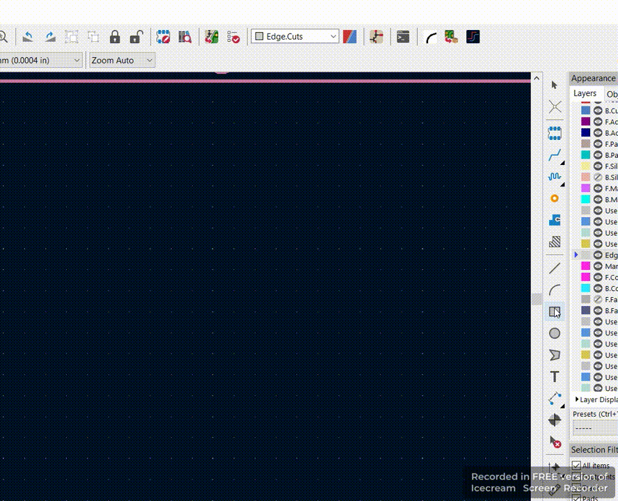

# (No longer needed)Fillet Rectangles (KiCAD plugin)
# KiCAD 7.0 has this functionality inbuilt. Create a rectangle -> Right click -> Fillet lines

A simple KiCAD plugin to create rounded corners for PCBs.

## Installation
To install the plugin:  
pcbnew -> Tools -> External Plugins -> Open Plugin Directory -> Extract and paste the downloaded plugin folder
